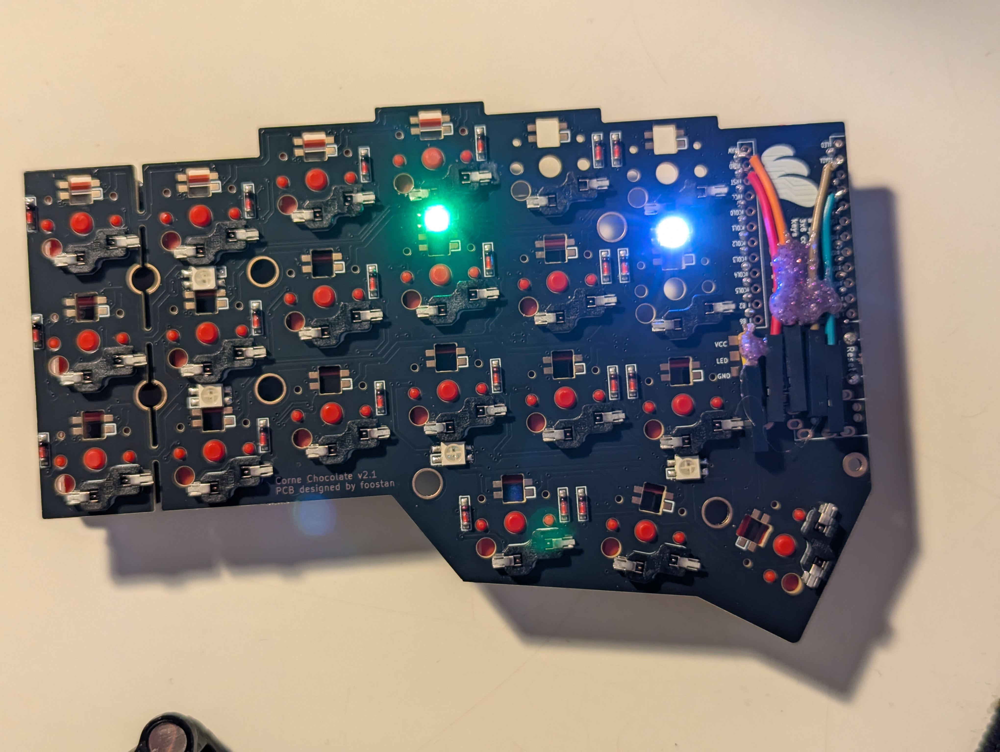

# zmk-config-corne

ZMK firmware for a [foostan Corne Chocolate v2.1](https://github.com/foostan/crkbd) split keyboard with two [nice!nano v2](https://nicekeyboards.com/nice-nano/) controllers, plus:

- A **PS/2 TrackPoint** on the right (central) half.
- One **EverydayErgo MEH01** mouse-wheel encoder with push-switch per half.
- **No RGB underglow**, **no OLED** (the high-frequency PS/2 pin layout needs `P0.06`, which the upstream Corne shield bound to WS2812 MOSI).



---

## Table of contents

1. [Hardware bill of materials](#hardware-bill-of-materials)
2. [Pin allocation](#pin-allocation)
3. [Wiring guide](#wiring-guide)
4. [Build and flash](#build-and-flash)
5. [Repository layout](#repository-layout)
6. [Keymap](#keymap)
7. [TrackPoint tuning](#trackpoint-tuning)
8. [Power management](#power-management)
9. [Known issues and gotchas](#known-issues-and-gotchas)
10. [Future to-dos](#future-to-dos)
11. [Credits](#credits)

---

## Hardware bill of materials

| Component | Detail |
|---|---|
| PCB | foostan Corne Chocolate v2.1 (purchased partly soldered: diodes, hot-swap sockets, SK6812-mini-e underglow LEDs) |
| Controllers | 2× nice!nano v2 |
| Switches | Kailh Choc v1 (hot-swap) |
| Pointing device | PS/2 TrackPoint module (red-cap, generic IBM/Lenovo-compatible) — right half only |
| Encoders | 2× [EverydayErgo MEH01](https://github.com/EverydayErgo/MEH01) (Kailh 5 mm mouse encoder in a 3D-printed housing, with a separate 3×4×2 mm tact switch for click) — one per half |

### Hardware modifications already applied

- **`LED1` desoldered on both halves.** PS/2 SCL drives `D1` (P0.06) with clock pulses; the underglow WS2812 chain has its `DIN` line on that same pin. With LED1 removed the chain has no input — the remaining five LEDs per half are still powered but never receive valid data, so they stay dark. Software alone cannot prevent this: the pin is actively driven by the PS/2 UART, and any WS2812 connected to it will interpret the clock as garbled RGB frames.

---

## Pin allocation

| Function           | Left (D-pin)    | Right (D-pin)   | nRF52 pin |
|--------------------|-----------------|-----------------|-----------|
| Matrix rows        | 4, 5, 6, 7      | 4, 5, 6, 7      | -         |
| Matrix cols        | 14, 15, 18-21   | 14, 15, 18-21   | -         |
| Encoder A          | 16              | 16              | P0.10     |
| Encoder B          | 10              | 10              | P0.09     |
| Encoder click      | 8               | 8               | P1.04     |
| TP SCL (clock)     | -               | 1               | P0.06     |
| TP SDA (data)      | -               | 0               | P0.08     |
| TP POR (reset)     | -               | 9               | P1.06     |
| **Free spares**    | 0, 1, 2, 3, 9   | 2, 3            | -         |

`P0.06` is the load-bearing pin choice. On the stock Corne shield it is `WS2812 MOSI` via `SPI3`; here it is the high-frequency PS/2 SCL line. Every other downstream decision (no underglow, no OLED if it would have shared the same bus, the explicit `&spi3 { status = "disabled"; }` in `boards/shields/corne_tp/boards/nice_nano_v2.overlay`) flows from that.

The high-frequency PS/2 pin variant was chosen over the low-frequency one (`D16/D10/D9`) because high-freq pins have cleaner Bluetooth coexistence. The trade-off is that high-freq SCL=`D1` conflicts with WS2812, hence the RGB removal.

---

## Wiring guide

### Encoder (both halves, identical)

| MEH01 lead | nice!nano pad | Notes |
|---|---|---|
| A | `D16` | GPIO active high, internal pull-up |
| B | `D10` | GPIO active high, internal pull-up |
| Switch (click) | `D8`  | GPIO active **low**, internal pull-up — the click is wired between `D8` and GND |
| Common / GND  | `GND` | Encoder common and switch other-leg both to GND |

Verified by multimeter: rotating the encoder alternates A and B between connected-to-GND and open-circuit; pressing the click connects `D8` to GND.

### TrackPoint (right half only)

| TP lead | nice!nano pad | Purpose |
|---|---|---|
| CLK / SCL | `D1`  | PS/2 clock — high-freq (P0.06) |
| DATA / SDA | `D0`  | PS/2 data — high-freq (P0.08), also UART0 RX in pinctrl |
| RST (Power-On-Reset) | `D9` | Drives the TP's RST line for the POR sequence |
| VCC | `3.3V` pad | TP power |
| GND | `GND` | — |

The TP draws roughly 5–8 mA active and ~1 mA when streaming is paused. The nice!nano LDO can supply ~250 mA, so headroom is large.

If your TP shows 3.3 V at VCC for a few seconds after boot and then goes dark, that's the previous build's `ext_power state = off` value being restored from flash. Flash `settings_reset.uf2` on the affected half to wipe the persisted state, then re-flash the working firmware. See [Build and flash](#build-and-flash).

---

## Build and flash

### Building

No local toolchain required. Every push to `main` triggers `.github/workflows/build.yml`, which calls the upstream ZMK reusable workflow against `build.yaml`:

```yaml
include:
  - board: nice_nano_v2
    shield: corne_tp_left
  - board: nice_nano_v2
    shield: corne_tp_right
  - board: nice_nano_v2
    shield: settings_reset
```

Three artifacts are produced per build: `corne_tp_left.uf2`, `corne_tp_right.uf2`, `settings_reset.uf2`.

### Flashing

1. Double-tap the reset button on the nice!nano. The on-board orange LED turns solid; the device mounts as a USB mass-storage volume named `NICENANO`.
2. Drag-drop the relevant UF2 onto the volume. The board reboots into the new firmware automatically.

**First flash after structural changes (shield rename, BT settings, ext-power changes):**

1. Flash `settings_reset.uf2` to both halves first. This wipes BLE pairings and stale persisted Kconfig state.
2. Flash `corne_tp_left.uf2` to the left, `corne_tp_right.uf2` to the right.
3. Power on both halves. The right (central) advertises; the left (peripheral) connects.

### Why this stack

The west manifest (`config/west.yml`) pulls a deliberately non-mainline set of dependencies:

```yaml
- name: zmk
  remote: infused-kim
  revision: pr-testing/mouse_ps2_module_base
- name: kb_zmk_ps2_mouse_trackpoint_driver
  remote: infused-kim
  revision: main
- name: zmk-tri-state
  remote: dhruvinsh
  revision: 9e44394   # pinned, see "Known issues" below
```

- **`infused-kim/zmk@pr-testing/mouse_ps2_module_base`** is the only ZMK fork currently confirmed to compile cleanly with the `kb_zmk_ps2_mouse_trackpoint_driver` module. Upstream `zmkfirmware/zmk@main` is missing the mouse PR and won't link against the PS/2 driver; petejohanson's pointing-PR fork compiles ZMK but has API changes that break the PS/2 driver.
- **`kb_zmk_ps2_mouse_trackpoint_driver`** provides the `zmk,input-mouse-ps2` device, the `&mms` runtime-tuning behavior, and the UART/GPIO PS/2 protocol drivers.
- **`dhruvinsh/zmk-tri-state`** provides the `&swapper` behavior used for Alt-Tab. Pinned to commit `9e44394` (Feb 2024) — see [Known issues](#known-issues-and-gotchas).

Re-evaluate the fork choices once the upstream pointing-device PR merges into `zmkfirmware/zmk@main`.

---

## Repository layout

```
.
├── README.md                          # this file
├── CLAUDE.md                          # operating instructions for Claude Code
├── build.yaml                         # GitHub Actions build matrix
├── .github/workflows/build.yml        # CI entry point
├── config/
│   ├── corne_tp.conf                  # Kconfig (must be named <shield>.conf)
│   ├── corne_tp.keymap                # 7-layer keymap (must be named <shield>.keymap)
│   ├── west.yml                       # west manifest
│   └── include/
│       └── mouse_tp.dtsi              # TP macros + side-conditional DT overrides
└── boards/
    └── shields/
        └── corne_tp/                  # local shield, replaces upstream Corne
            ├── corne_tp.dtsi          # shared base: matrix transform, kscan-composite, encoders, sensors
            ├── corne_tp_left.overlay  # left half (peripheral)
            ├── corne_tp_right.overlay # right half (central) — PS/2 hardware + interrupt overrides
            ├── corne_tp.zmk.yml       # shield metadata
            ├── Kconfig.defconfig      # forces right half as ZMK_SPLIT_ROLE_CENTRAL
            ├── Kconfig.shield         # SHIELD_CORNE_TP_LEFT / SHIELD_CORNE_TP_RIGHT booleans
            └── boards/
                └── nice_nano_v2.overlay  # explicitly disables &spi3 to free P0.06
```

**Naming matters.** ZMK's config discovery walks a candidate list derived from the shield name (`corne_tp_right`, `corne_tp`, `nice_nano_v2`, etc.). Files named `corne.conf` or `corne.keymap` are silently ignored — see [Known issues](#known-issues-and-gotchas).

---

## Keymap

### Layer overview

| Index | Name | Access |
|-------|------|--------|
| 0 | Colemak-DH | base layer |
| 1 | Symbols + Numpad | right thumb `&mo 1` |
| 2 | Extend / Navigation | left inner thumb `&mo 2` |
| 3 | Function + Media | **conditional**, hold layers 1 + 2 simultaneously |
| 4 | Bluetooth + TP-set entry | `&mo 4` from layer 2 |
| 5 | Mouse / TrackPoint | **auto-activated** by TP movement (250 ms debounce) |
| 6 | TrackPoint settings | `&tog 6` from layer 4 (and from layer 5 outer corners) |

### Key positions

```
Row 0:    0   1   2   3   4   5       6   7   8   9  10  11
Row 1:   12  13  14  15  16  17      18  19  20  21  22  23
Row 2:   24  25  26  27  28  29      30  31  32  33  34  35
Thumb:           36  37  38              39  40  41
Encoder click:           42                       43
```

The matrix-transform has `rows = <5>` and `columns = <12>`. Positions 0–41 are the 42 physical keys. Position 42 is the left encoder click (synthetic `RC(4,0)`), position 43 is the right encoder click (synthetic `RC(4,6)`, after the right-half `col-offset = <6>`).

### Thumb cluster

```
Left:   mt(LCTRL,ESC)  SPACE  mo(2)  |  mo(1)  LSHFT  BSPC   :Right
```

- `&mt LCTRL ESC` — tap for ESC (nvim normal mode), hold for Ctrl.
- Space and Shift are on separate hands so German capitalisation flows: `Space → Shift+letter` without same-hand awkwardness.
- Layers 1 and 2 both have `&trans` on the opposite layer's `&mo` position so the conditional Layer-3 combo (`if-layers = <1 2>`) actually fires.

### Custom behaviors

Defined in `config/corne_tp.keymap:37–73`:

- **`swapper`** — tri-state Alt-Tab. First tap holds Alt+Tab; subsequent taps issue Tab; releasing the layer releases Alt. `ignored-key-positions = <15>` allows sticky Shift for reverse cycling.
- **`skh`** — sticky-or-hold. Tap = sticky modifier (latches via `&sk`); hold = plain modifier (no latch on release). Used on the home-row mods so Ctrl+scroll-zoom doesn't leave Ctrl stuck.
- **`inc_dec_msc`** — sensor-rotate-var bound to `&msc` (mouse scroll) instead of the stock `&kp`. The fork's `&msc` is `behavior-input-two-axis`, which accumulates fractional motion across periodic ticks. `tap-ms = <130>` is required to span enough ticks for the accumulator to cross the integer threshold — see the inline comment in the keymap for the math.

### Encoder behavior

| Layer | Left encoder rotation | Right encoder rotation | Click (both) |
|---|---|---|---|
| 0 Colemak | `&inc_dec_msc SCRL_RIGHT SCRL_LEFT` | `&inc_dec_msc SCRL_DOWN SCRL_UP` | `&mkp MCLK` |
| 1 Symbols | same | same | `&mkp MCLK` |
| 2 Extend | same | same | `&mkp MCLK` |
| 3 Function | `&inc_dec_kp C_VOL_UP C_VOL_DN` | `&inc_dec_kp C_NEXT C_PREV` | `&mkp MCLK` |
| 4 BT | same as layer 0 | same as layer 0 | `&none` |
| 5 MOUSE_TP | same as layer 0 | same as layer 0 | `&mkp MCLK` |
| 6 MOUSE_TP_SET | same as layer 0 *(see to-do)* | same | `&none` |

CW rotation = scroll down / scroll right (the "natural" mouse-wheel direction). If your TP feels reversed on either axis, swap the two arguments in the corresponding `sensor-bindings` line.

---

## TrackPoint tuning

The PS/2 module exposes runtime-adjustable settings via the `&mms` behavior. Each `U_MSS_TP_*` macro increments or decrements one value, takes effect immediately, and is auto-persisted to flash after `CONFIG_ZMK_SETTINGS_SAVE_DEBOUNCE` (60 s).

### Workflow

1. Hold left inner thumb to activate Layer 2.
2. While holding Layer 2, tap the right-thumb key bound to `&mo 4` (enters Layer 4).
3. From Layer 4, tap the outer-top corner (either side) → toggles into Layer 6 (MOUSE_TP_SET).
4. Adjust the relevant knob; test; iterate.
5. Once dialled in, press `U_MSS_LOG` (top-left of layer 6). The current settings dump to USB serial as a copy-paste-ready `&mouse_ps2 { … }` block.
6. Paste those values into the `&mouse_ps2` node in `boards/shields/corne_tp/corne_tp_right.overlay`. Hardcoded values survive `settings_reset`; flash-stored values do not.

### Knobs

| Macro | TP setting | Default | Useful range | Effect |
|---|---|---|---|---|
| `U_MSS_TP_S_I` / `U_MSS_TP_S_D` | `tp-sensitivity` | 128 | 80–200 | overall pointer sensitivity |
| `U_MSS_TP_V6_I` / `U_MSS_TP_V6_D` | `tp-val6-upper-speed` | 97 | 60–150 | max speed under sustained force (transfer function plateau) |
| `U_MSS_TP_NI_I` / `U_MSS_TP_NI_D` | `tp-neg-inertia` | 6 | 6–12 | **fights post-release drift** — raise if the cursor keeps creeping after you let go |
| `U_MSS_TP_PT_I` / `U_MSS_TP_PT_D` | `tp-press-to-select-threshold` | 9 | n/a | only effective if `tp-press-to-select;` is added in DT (it isn't here) |
| `U_MSS_LOG` | — | — | — | print current settings to USB serial |
| `U_MSS_RESET` | — | — | — | wipe flash settings + restore TP firmware defaults |

### Axis inversion

The TP module is mounted such that pushing forward gives cursor-up, which required inverting the Y axis. Done in `config/include/mouse_tp.dtsi`:

```dts
&mouse_ps2_input_listener {
    layer-toggle = <MOUSE_TP>;
    layer-toggle-delay-ms = <250>;
    layer-toggle-timeout-ms = <250>;
    y-invert;
};
```

Available booleans on this listener: `xy-swap`, `x-invert`, `y-invert`. The X axis is correct as-is.

---

## Power management

```ini
# config/corne_tp.conf
CONFIG_ZMK_IDLE_TIMEOUT=30000          # idle after 30 s
CONFIG_ZMK_SLEEP=y                     # enable deep sleep
CONFIG_ZMK_IDLE_SLEEP_TIMEOUT=900000   # deep sleep after 15 min
CONFIG_BT_CTLR_TX_PWR_PLUS_8=y         # +8 dBm BT TX for stronger split link
```

`CONFIG_ZMK_EXT_POWER` is left at its default (enabled). The nice!nano's exposed `3.3V` pad is gated by the P0.13 EXT_POWER load switch; if you ever see the TP go dead after 30 s of inactivity, that's the rail being switched off on idle. ZMK auto-restores it on the next wake (any key press, BLE activity, or USB attach), but the TP needs its full POR sequence to come back up. If this becomes a problem in practice, the workaround is `CONFIG_ZMK_EXT_POWER=n` (leaves P0.13 floating, load switch defaults on).

---

## Known issues and gotchas

These are the non-obvious things we hit during this build. Symptoms and resolutions both included.

### Build / config discovery

- **`<shield>.conf` and `<shield>.keymap` must match the shield name.** ZMK's config discovery walks a candidate list derived from the shield name (`corne_tp_right.conf`, `corne_tp.conf`, `nice_nano_v2.conf`, `default.conf`). Files named `corne.conf` or `corne.keymap` are silently skipped. **Symptom:** firmware boots with all Kconfig at defaults (no `ZMK_MOUSE`, no logging, no BT boost) and the keymap is whatever upstream provides — usually the upstream Corne `corne.keymap`. **Fix:** rename to `corne_tp.*`.

- **`CONFIG_ZMK_POINTING` does not exist on the infused-kim fork.** It's a Kconfig symbol from the upstream pointing PR. **Symptom:** Kconfig aborts with "attempt to assign the value 'y' to the undefined symbol ZMK_POINTING". **Fix:** use `CONFIG_ZMK_MOUSE=y` alone.

### Encoder

- **`EC11_TRIGGER` defaults to `NONE`.** The EC11 driver enables itself automatically when `DT_HAS_ALPS_EC11_ENABLED`, but the choice block `EC11_TRIGGER_MODE` defaults to `EC11_TRIGGER_NONE`. **Symptom:** the encoder is visible in the devicetree, the GPIO transitions register in `<dbg> EC11:` log lines, but no sensor events reach the keymap; rotation does nothing. **Fix:** `CONFIG_EC11_TRIGGER_GLOBAL_THREAD=y`.

- **`inc_dec_msc` needs `tap-ms ≥ 130`.** The fork's `&msc` is `behavior-input-two-axis`. Each tick (`trigger-period-ms = 16` default) adds `speed × 16 / 1000 = 10 × 0.016 = 0.16` to a fractional accumulator. Wheel events fire only when the accumulator crosses an integer boundary, which takes ~7 ticks (~112 ms). With the sensor-rotate-var default `tap-ms = <5>`, the press releases before any wheel event is emitted. **Symptom:** rotation logs all the way through `behavior_input_two_axis_adjust_speed: Adjusting: 0 -10` but no `INPUT_REL_WHEEL` events get to HID. **Fix:** `tap-ms = <130>` in the `inc_dec_msc` definition.

### Dependencies

- **`dhruvinsh/zmk-tri-state` is pinned to `9e44394` (Feb 2024).** Later commits on `main` reference a `struct zmk_behavior_binding_event.source` field that the infused-kim fork's older Zephyr API does not have. **Symptom:** `behavior_tri_state.c` fails to compile on the central half with `'struct zmk_behavior_binding_event' has no member named 'source'`. **Fix:** the pin in `config/west.yml`. If the ZMK fork ever moves forward to a Zephyr that has this field, unpin.

### Hardware

- **WS2812 underglow decodes PS/2 SCL as garbled RGB frames.** With WS2812 disabled in software, the LEDs are still wired to `D1` via the underglow chain. PS/2 clock pulses look like color-byte streams to the first LED, which latches some color and forwards a partial frame; the next LED catches the leftover bits and latches its own color; eventually the timing breaks down and the rest of the chain stays dark. **Symptom:** two or three LEDs glow random colors whenever the TP is active. **Fix:** desolder `LED1` (the first in the chain, with its DIN pad directly wired to D1) on each half. The remaining LEDs see a floating DIN and stay dark forever.

### Flash / persistence

- **Stale settings can override new Kconfig values.** Settings written to flash (`ext_power state`, BT pairings, TP runtime settings) are loaded on boot and may override the in-firmware defaults. **Symptom:** after a major reconfiguration, VCC turns off shortly after boot, or BT halves refuse to pair, or TP settings revert to weird values. **Fix:** flash `settings_reset.uf2` on the affected half, then re-flash the working firmware.

### Bluetooth (unresolved)

- **Split central disconnects from peripheral ~2/sec with reason 0x13.** Observed in serial logs from the central half. Reason `0x13` (`Remote User Terminated Connection`) means the peripheral initiates the disconnect. **Suspected causes:** `CONFIG_BT_CTLR_TX_PWR_PLUS_8=y` may be overdriving the peripheral's receiver at close range; or the peripheral half is undervolted from a flaky USB cable or dying battery. **Diagnostic:** `CONFIG_BT_LOG_LEVEL_INF=y` is currently set so future captures will surface connection events. **Not yet fixed.**

### Debug-logging trade-offs

- **Verbose logging is currently enabled** in `config/corne_tp.conf`:
  ```ini
  CONFIG_ZMK_USB_LOGGING=y
  CONFIG_ZMK_LOG_LEVEL_DBG=y
  CONFIG_SENSOR_LOG_LEVEL_DBG=y
  CONFIG_BT_LOG_LEVEL_INF=y
  ```
  USB CDC stays alive, the controller never enters deep sleep, and PS/2 motion at 40 Hz generates ~240 log lines per second. **Battery drain is significant.** Revert to `CONFIG_ZMK_LOGGING_MINIMAL=y` once the remaining encoder + BLE issues are resolved.

---

## Future to-dos

- [ ] Tune encoder `steps` from `<80>` (tactile-EC11 convention) to `<24>` or `<30>` to match the MEH01's Kailh mouse encoder (~24 quadrature transitions per rotation). Currently the keymap sees only ~6 triggers per full rotation; should be closer to 20.
- [ ] Bake tuned TP settings (`tp-sensitivity`, `tp-neg-inertia`, `tp-val6-upper-speed`) into the `&mouse_ps2` node in `boards/shields/corne_tp/corne_tp_right.overlay` once dialled in via runtime tuning.
- [ ] Revert the debug-logging block in `config/corne_tp.conf` to `CONFIG_ZMK_LOGGING_MINIMAL=y` once encoder + TP + split issues are resolved.
- [ ] Investigate the BLE split disconnect storm (`reason 0x13`). Likely candidates: drop `CONFIG_BT_CTLR_TX_PWR_PLUS_8`, check left-half battery / USB cable continuity, or check for shared antenna interference from the PS/2 traffic.
- [ ] Replace `sensor-bindings` on the `mouse_tp_set_layer` (layer 6) with `<&none &none>`. Currently accidental encoder rotation during TP tuning spams scroll output into whatever app has focus.
- [ ] Consider writing a custom single-shot wheel behavior that calls `input_report_rel(INPUT_REL_WHEEL, ±1)` directly, bypassing the input-two-axis accumulator entirely. Would replace the `tap-ms = <130>` hack with deterministic 1-event-per-detent semantics.

---

## Credits

- [foostan](https://github.com/foostan) for the Corne Chocolate v2.1 PCB.
- [infused-kim](https://github.com/infused-kim) for the [ZMK fork](https://github.com/infused-kim/zmk/tree/pr-testing/mouse_ps2_module_base) and the [PS/2 driver module](https://github.com/infused-kim/kb_zmk_ps2_mouse_trackpoint_driver).
- [dhruvinsh](https://github.com/dhruvinsh) for [zmk-tri-state](https://github.com/dhruvinsh/zmk-tri-state).
- [EverydayErgo](https://github.com/EverydayErgo) for the [MEH01 encoder design](https://github.com/EverydayErgo/MEH01).
- The [ZMK Firmware](https://zmk.dev/) project for everything underneath.

Relevant upstream pull requests:
- [ZMK PR #1751](https://github.com/zmkfirmware/zmk/pull/1751) — Add PS/2 Mouse / TrackPoint / Trackpad / Trackball support
- [ZMK PR #2027](https://github.com/zmkfirmware/zmk/pull/2027) — Mouse pointer movement / scrolling
